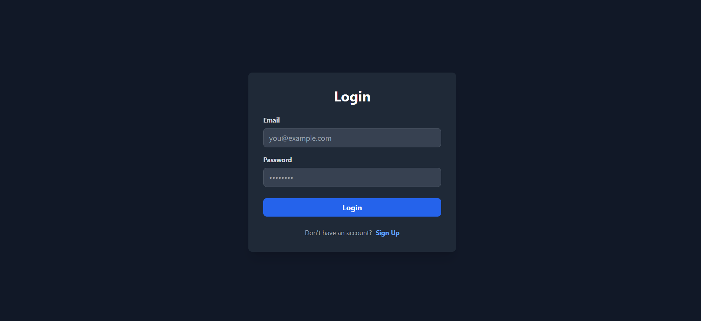
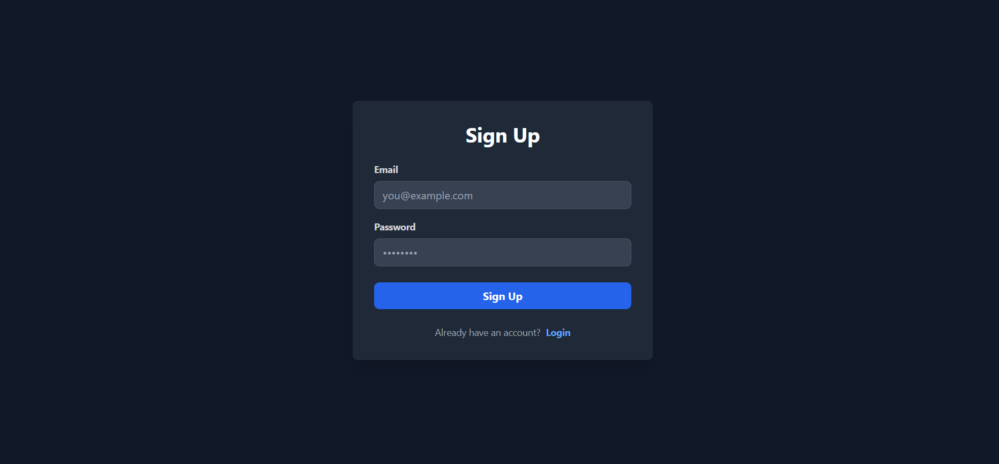
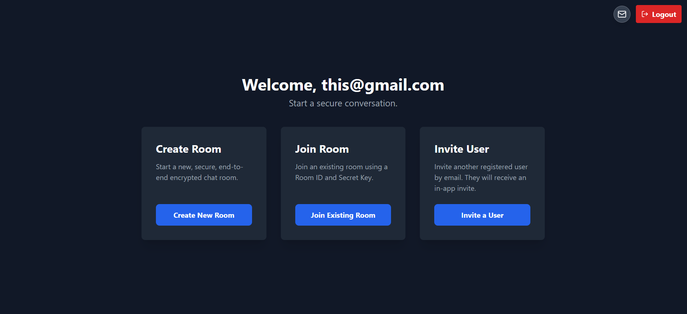
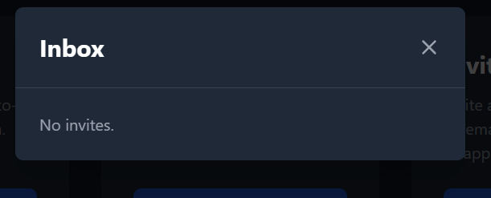
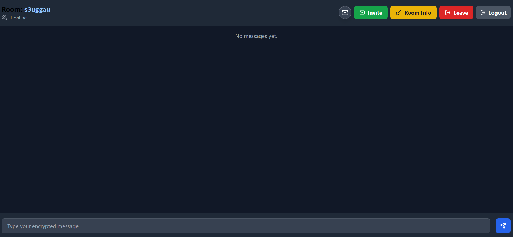
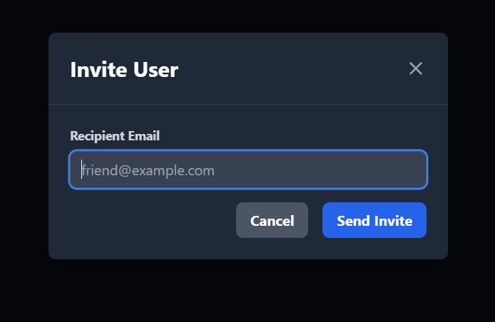
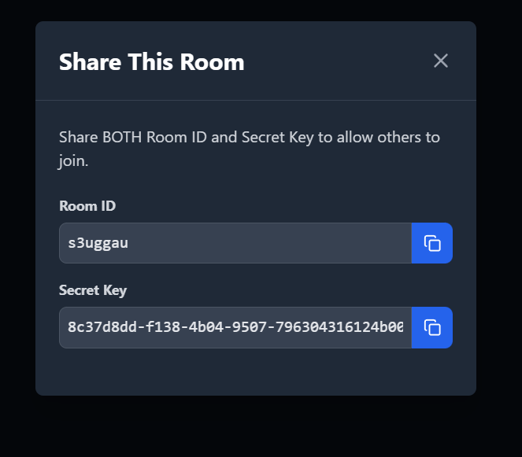
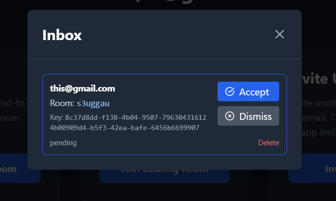
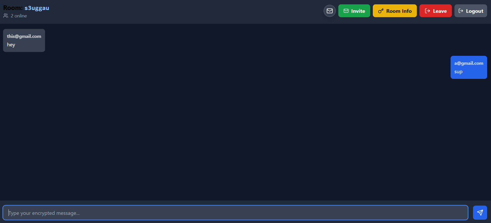
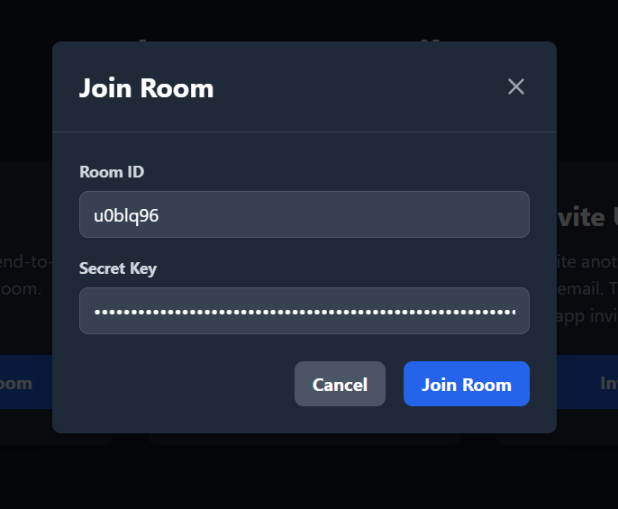

# MimiChat

MimiChat is a secure, end-to-end encrypted chat application built with React, Vite, Firebase, and modern AES-GCM encryption using the Web Crypto API. It supports real-time messaging, invite-only chat rooms, user authentication, and a clean TailwindCSS-powered UI.

---

## Features

### **Authentication**
- Email + Password login and signup
- Firebase Authentication session handling
- Redirects based on authentication state

### **Home Dashboard**
- Create new rooms (Room ID + Secret Key)
- Join existing rooms using Room ID + Secret Key
- Send room invites to other users
- Inbox for received invites
- Logout functionality

### **Encrypted Chat Rooms**
- Real-time messaging using Firestore
- AES-GCM encryption for every message
- Firebase stores only ciphertext + IV
- Secret room key is never uploaded or stored server-side

### **End-to-End Encryption**
Implemented through a dedicated CryptoHelper utility:
- Key derivation using PBKDF2 (SHA-256, 100k iterations)
- AES-GCM encryption with random IV per message
- AES-GCM decryption on message load

---

## Tech Stack

| Layer | Technology |
|-------|------------|
| Frontend | React, Vite |
| Styling | TailwindCSS |
| Database | Firestore |
| Auth | Firebase Authentication |
| Cryptography | WebCrypto API (AES-GCM) |
| Icons | Lucide React |

---

## Installation & Setup

### **1. Clone the repository**
```sh
git clone https://github.com/rohit20045/mimichat.git
cd mimichat
```
Or just download the zip and Extract then open it in Vs code. 

Before running the next step make sure all the file are correctly in their directory and run this in root directory in vscode terminal
If you want to change the name of chat app just go to View - Search and search mimi and replace it only three places change matter index.html, package-lock.json, package.json


### **2. Install dependencies**
Now open Terminal make sure its in root ( outside src there is no extra folder directory inbetween) Then run this 

- npm install

If it shows things like npm audit report 5 vulnerabilities (4 low, 1 high)  To address issues that do not require attention, 
run: npm audit fix . -- No need to worry ignore it --

### **3. Setup**
- Create a Firebase Account
- Click Get Started by setting up a FireBase Project
- Enter the name of Project Next - Take the AI and test feature as per your need (not necessary for this)
- Once in Go to Build - Authenticaton - Get Started - Select Email/Password and Enable it (Email link (passwordless sign-in) not necessary) The Save
- Go To Build - Firestore Database - Standard Edition - Keep default - Start in test mode
- Now in Project Overview Click Add App - Select Web, Keep other option unchecked 
- Now in npm copy the 'Your web app's Firebase configuration' only and replace in firebase.js in /src line 28 to 36
- Now when user sign up their data will saved and viewable in firestore database. Try it

const firebaseConfig = {
  apiKey: "...",
  authDomain: "...",
  projectId: "...",
  storageBucket: "...",
  messagingSenderId: "...",
  appId: "...",
};


### **5. Run the app**
```sh
npm run dev
```

## Security Overview
- Every message is encrypted before being uploaded
- Firebase never sees plaintext messages
- Secret keys are never stored in Firestore
- AES-GCM with PBKDF2 key derivation

This provides a zero-knowledge communication model.

### Project ScreenShots
Login Page             |  SignUp Page
:-------------------------:|:-------------------------:
  |  
Home Page             |  Inbox
  |  
ChatRoom             |  Invite User 
  |  
Room Info            |  Inbox with Invitation
  |  
ChatRoom Message            |  Join Room 
  |  
